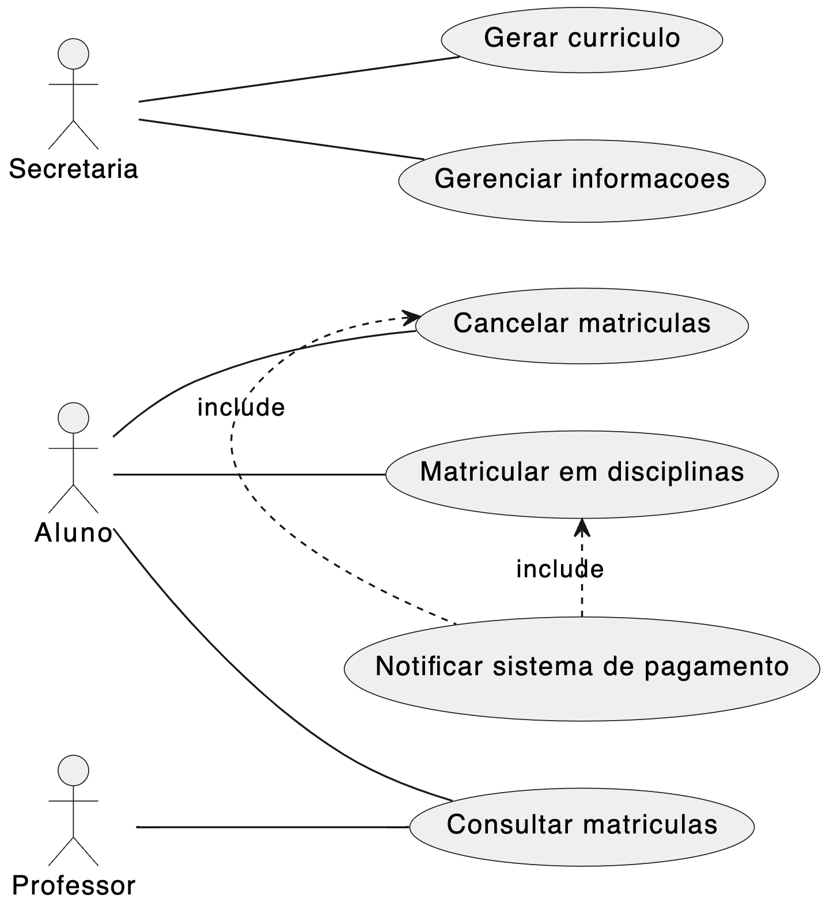

# Sistema de Matrícula

Este projeto é um protótipo de aplicação de sistema e matrículas para uma universidade, desenvolvido em interface de linha de comando (cli - *command-line interface*) utilizando a linguagem Java.

Trata-se de um projeto acadêmico desenvolvido para a disciplina de Laboratório de Desenvolvimento de Software, do curso de Engenharia de Software da Pontifícia Universidade Católica de Minas Gerais (PUC Minas).

## Integrantes
* Gustavo Menezes Barbosa 
* Pedro Henrique Dias Camara 
* Milena Lara Reis Ferreira

## Orientadores
* Cristiano de Macêdo Neto 

## Descrição do Problema

Uma universidade pretende informatizar seu sistema de matrículas. A secretaria da universidade gera o currículo para cada semestre e mantém as informações sobre as disciplinas, professores e alunos.

Cada curso tem um nome, um determinado número de créditos e é constituído por diversas disciplinas.

Os alunos podem se matricular em 4 disciplinas como 1ª opção (obrigatórias) e em mais 2 outras alternativas (optativas).

Há períodos para efetuar matrículas, durante os quais um aluno pode acessar o sistema para se matricular em disciplinas e/ou para cancelar matrículas feitas anteriormente.

Uma disciplina só fica ativa, isto é, só vai ocorrer no semestre seguinte se, no final do período de matrículas tiver, pelo menos, 3 alunos inscritos (matriculados). Caso contrário, a disciplina será cancelada. O número máximo de alunos inscritos a uma disciplina é de 60 e quando este número é atingido, as inscrições (matrículas) para essa disciplina são encerradas.

Após um aluno se inscrever para um semestre, o sistema de cobranças é notificado pelo sistema de matrículas, de modo que o aluno possa ser cobrado pelas disciplinas daquele semestre.

Os professores podem acessar o sistema para saber quais são os alunos que estão matriculados em cada disciplina.

Todos os usuários do sistema têm senhas que são utilizadas para validação do respectivo login.

## Requisitos funcionais  
| ID     | Descrição do Requisito | Prioridade |  Depende de |
|--------|------------------------|------------|-------------|  
| RF-001 | O sistema deve permitir o gerenciamento de disciplinas, devendo conter informações sobre nome, carga horária, ementa e status (indefinido, ativa ou cancelada). | ALTA |  |
| RF-002 | O sistema deve permitir o gerenciamento de cursos, devendo conter informações sobre nome, número de créditos e disciplinas. | ALTA | RF-001 |
| RF-003 | O sistema deve permitir o gerenciamento de alunos, devendo conter informações sobre nome completo, senha de acesso, número de matrícula e CPF. | ALTA |  |
| RF-004 | O sistema deve permitir o gerenciamento do período de matrícula, devendo conter informações sobre data e hora de início e data e hora de fim. | ALTA |  |
| RF-005 | O sistema deve permitir que funcionários administrativos, alunos e professores acessem o sistema somente mediante autenticação com usuário e senha. No caso de alunos, o usuário deve ser o número de matrícula. | ALTA |  |
| RF-006 | O sistema deve permitir que alunos efetuem a matrícula em disciplinas dentro do período estabelecido. Os alunos devem poder incluir ou cancelar disciplinas. | ALTA | RF-004, RF-005 |
| RF-007 | Terminado o período de matrícula, o sistema deverá alterar o status das disciplinas de indefinido para ativa (nos casos em que haja pelo menos 3 alunos matriculados) ou cancelada (nos casos em que haja menos de 3 alunos matriculados). | MÉDIA | RF-004 |
| RF-008 | O sistema deve permitir que professores visualizem a lista de alunos matriculados nas disciplinas que ministram. | MÉDIA | RF-005 |
| RF-009 | O sistema de matrícula deve notificar o sistema de cobranças sobre as disciplinas em que cada aluno foi matriculado. | MÉDIA | RF-006, RF-007 |

  
## Requisitos não funcionais  
| ID | Descrição do Requisito | Prioridade |  
|--|--|--|  
| RNF-001 | O sistema deverá ser desenvolvido em Java | ALTA |  
| RFN-002 | O sistema deverá ser desenvolvido em interface de linha de comando | ALTA |  
| RFN-003 | Os dados das entidades do sistema devem ser persistidos em arquivos | ALTA |  

## Diagrama de Caso de Uso

## Histórias de Usuário

Eu como secretário quero gerar os currículos disponíveis no sistema para manter as disciplinas.

Eu como secretário quero gerenciar as informações relevantes dos alunos, professores e disciplinas no sistema para gerir os usuários. 

Eu como professor quero consultar as matrículas relevantes às minhas matérias no sistema para ficar ciente dos alunos matriculados.

Eu como aluno quero me matrícular em disciplinas para cursa-las. 

Eu como aluno quero cancelar as matrículas relevantes para retira-las do pagamento. 

Eu como aluno quero pagar as disciplinas que estou matriculado para mante-las. 

Eu como sistema de cobrança quero receber notificações referentes a matrícula de um aluno para cobra-lo.

## Diagrama de Classe

## Instruções de utilização
1 - Abra o diretório raiz do repositório no terminal de comando e execute `cd ./project/code`

2 - Execute o comando `javac -cp . App.java` para compilar o programa

3 - Execute o comando `java App` para executar o programa
